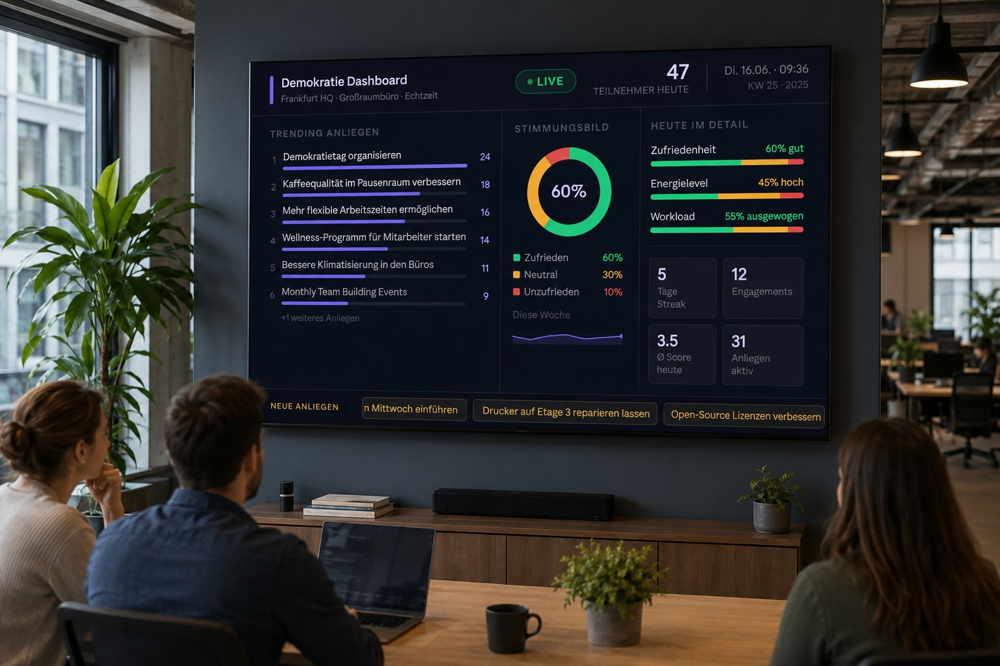
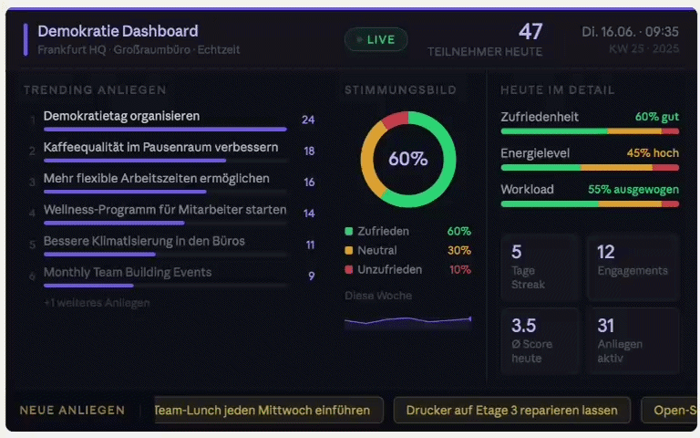

# App-Prototyp: Designforschung – Demokratie im Arbeitsalltag

**Ein Forschungsprojekt zur visuellen Vermittlung demokratischer Werte am Arbeitsplatz**

---

## 🔍 Forschungsfrage

> **Inwiefern werden demokratische Werte visuell im Arbeitsalltag vermittelt?**

Im Kurs *Designforschung* untersuchen wir, wie eine digitale Anwendung im Arbeitskontext Teilhabe, Transparenz und Mitbestimmung nicht nur funktional unterstützen, sondern auch **visuell erfahrbar** machen kann.

---

## 💡 Konzept und Vision

Unsere Idee ist ein System, mit dem Mitarbeitende regelmäßig eigene Gedanken, Ideen und Stimmungen einbringen können – niederschwellig, anonym und direkt im Arbeitsalltag.

### Kernfunktionen der geplanten Workplace-App

- **Ideen & Probleme einreichen**  
  Jede:r kann Vorschläge formulieren oder auf Anliegen anderer reagieren – etwa durch Zustimmung oder Ablehnung. So werden Themen sichtbar, die mehrere Personen beschäftigen.

- **Stimmungs- und Meinungsbilder**  
  Kurze, wiederkehrende Abstimmungen zu Stimmung, Workload oder allgemeiner Zufriedenheit ermöglichen ein kontinuierliches Pulse-Checking.

- **Persönliche Auswertung**  
  Mitarbeitende erhalten eine private Rückmeldung, z. B. wie oft sie sich eingebracht haben oder an wie vielen Tagen im Monat es ihnen gut ging.

- **Anonymes Dashboard**  
  Die gesammelten Daten fließen in eine für alle einsehbare Übersicht direkt am Arbeitsplatz. Dort werden z. B. visualisiert:
  - Mitarbeiterzufriedenheit im Zeitverlauf
  - häufig genannte oder hoch bewertete Themen
  - Ideenpitches und mögliche „Personenmatches“ für die Umsetzung
  - aufkommende Trends und Handlungsfelder

Ziel des Dashboards ist es, Teams und Organisationen dabei zu helfen, **relevante Themen schneller zu erkennen und daraus konkrete Maßnahmen abzuleiten** – demokratisch, transparent und auf Augenhöhe.

---

## 🧪 Der Prototyp

In diesem Repository findest du den Code eines **frühen, funktional noch eingeschränkten App-Prototyps**. Er ist live auf GitHub Pages erreichbar und vermittelt bereits einen guten Eindruck, wie sich die spätere Anwendung anfühlen soll.

👉 **[Prototyp jetzt ausprobieren](https://bht-transformation.github.io/prototyp_designforschung/concerns.html)**

Einige der oben beschriebenen Funktionen sind bereits angedeutet, andere liegen bislang nur als Konzept oder statisches Mockup vor. Die finalen Ergebnisse sollen später auf einem **Dashboard-Bildschirm direkt im Büro** anonym und in Echtzeit sichtbar sein.

---

## 🖼️ Dashboard-Mockups

Zur Veranschaulichung der geplanten Visualisierung sind im Repository zwei Mockups enthalten, die zeigen, wie das Dashboard am Arbeitsplatz später aussehen könnte:

  
*Statisches Mockup, wie das Dashboard in einem Großraumbüro wirken könnte.*

  
*Animation des alternativen Dashboard-Konzepts mit Fokus auf Ideenpitches und Mitwirkungsstatistiken in Aktion.*

---

## 🧑‍🔬 Mitmachen & Testen

Du bist herzlich eingeladen, den Prototypen zu testen und uns Feedback zu geben. Es gibt **kein Richtig oder Falsch** – uns interessiert deine spontane, ehrliche Wahrnehmung.

So kannst du teilnehmen:

1. **Öffne den Prototyp** unter dem oben stehenden Link.
2. **Probiere ihn in Ruhe aus** – klicke dich durch die vorhandenen Ansichten.
3. **Kehre anschließend zum Fragebogen zurück**, um deine Eindrücke festzuhalten:  
   👉 **[Zum Fragebogen](https://forms.gle/M1wKYa6neGMjjqnJ6)**  
   *Tipp: Deine bisherigen Eingaben im Formular bleiben zwischengespeichert, wenn du zwischen den Tabs wechselst.*

Alle Angaben werden **vollständig anonym** ausgewertet und dienen ausschließlich der wissenschaftlichen Untersuchung im Rahmen des Kurses.

---

## 🎓 Hintergrund

Dieses Projekt entsteht im Kurs **Designforschung** an der [Berliner Hochschule für Technik](https://www.bht-berlin.de/) (BHT) im Kontext von Transformationsdesign und partizipativer Arbeitsgestaltung. Der Prototyp ist als Forschungsartefakt zu verstehen, mit dem wir gestalterische Hypothesen überprüfen und weiterentwickeln.

---

## 🛠️ Technisches

- Der Prototyp ist eine statische Webanwendung (HTML, CSS, JavaScript).
- Gehostet mit GitHub Pages aus diesem Repository.
- Die Mockups liegen als PNG-Dateien im Ordner `mockups/`.
- Für die spätere Entwicklung ist eine Anbindung an eine anonymisierte Datenbank sowie eine Echtzeit-Dashboard-Komponente vorgesehen.

---

## 📄 Lizenz & Datenschutz

Die im Rahmen der Studie erhobenen Daten werden anonym verarbeitet und nicht mit einzelnen Personen verknüpft. Der Quellcode in diesem Repository ist – solange nicht anders gekennzeichnet – für Lehr- und Forschungszwecke freigegeben.

---

*Hast du Fragen oder Anmerkungen? Sprich uns gern im Kurs an oder eröffne ein Issue in diesem Repository.*
